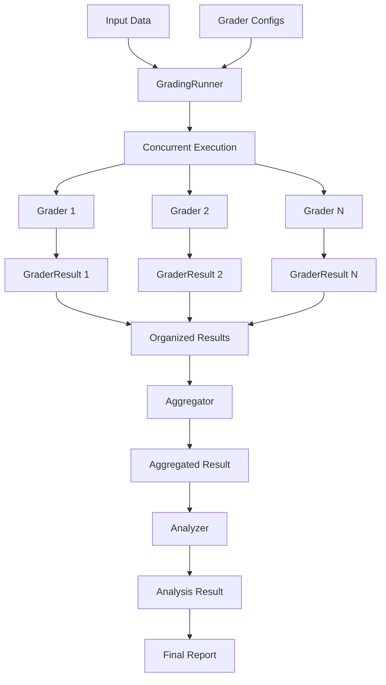
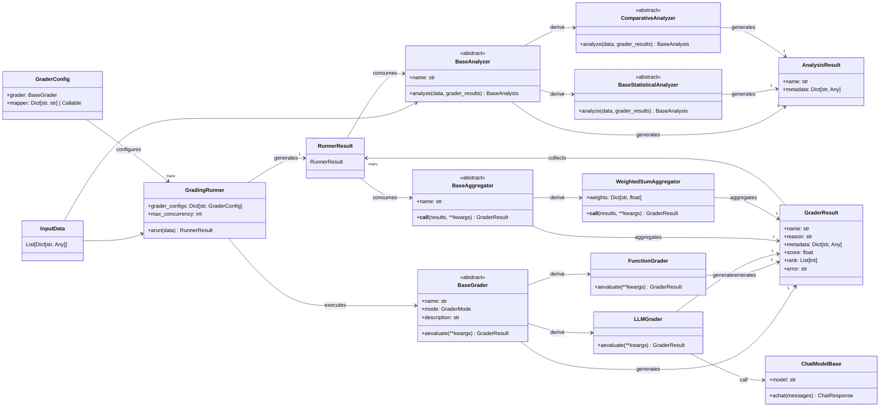

# RM-Gallery Core Architecture Workflow

## Overview

RM-Gallery是一个模块化的评估系统，用于评估AI模型的输出质量。它采用分层架构，从数据输入到最终分析结果的完整流程包括以下几个主要阶段：

1. 数据准备和输入
2. 评估执行（通过Graders）
3. 结果收集和组织
4. 分析和报告生成

## Workflow Visualization

### Detailed Workflow Diagram



### Class Relationships



## Core Components Architecture

### 1. 主要模块

```
rm_gallery.core/
├── analyzer/          # 分析器模块，用于分析评估结果
│   ├── statistical/   # 统计分析器子模块
│   └── comparative/   # 对比分析器子模块
├── graders/           # 评估器模块，包含各种类型的评估实现
├── models/            # 模型接口模块，用于与各种大语言模型交互
├── runner/            # 执行器模块，负责调度和执行评估任务
│   └── aggregator/    # 聚合器子模块，用于聚合多个评估器结果
└── utils/             # 工具模块，提供辅助功能
```

### 2. 关键类和它们的作用

#### Graders 模块
- [BaseGrader](file:///mnt3/huangsen.huang/codes/RM-Gallery/rm_gallery/core/graders/base_grader.py#L133-L281): 所有评估器的基类，定义了评估器的基本接口
  - [GraderMode](file:///mnt3/huangsen.huang/codes/RM-Gallery/rm_gallery/core/graders/base_grader.py#L12-L20): 枚举类型，定义评估模式（POINTWISE/LISTWISE）
  - [GraderResult](file:///mnt3/huangsen.huang/codes/RM-Gallery/rm_gallery/core/graders/base_grader.py#L23-L37): 评估结果基类
  - [GraderScore](file:///mnt3/huangsen.huang/codes/RM-Gallery/rm_gallery/core/graders/base_grader.py#L40-L52): 数值评分结果类型
  - [GraderRank](file:///mnt3/huangsen.huang/codes/RM-Gallery/rm_gallery/core/graders/base_grader.py#L72-L85): 排序结果类型
  - [GraderError](file:///mnt3/huangsen.huang/codes/RM-Gallery/rm_gallery/core/graders/base_grader.py#L110-L123): 错误结果类型

#### Runner 模块
- [GradingRunner](file:///mnt3/huangsen.huang/codes/RM-Gallery/rm_gallery/core/runner/grading_runner.py#L88-L316): 评估任务执行器，负责并发执行评估任务
  - [GraderConfig](file:///mnt3/huangsen.huang/codes/RM-Gallery/rm_gallery/core/runner/grading_runner.py#L43-L85): 评估配置类，包含评估器和数据映射器
  - [RunnerResult](file:///mnt3/huangsen.huang/codes/RM-Gallery/rm_gallery/core/runner/grading_runner.py#L24-L40): 评估结果集合类型

#### Aggregator 模块
- [BaseAggregator](file:///mnt3/huangsen.huang/codes/RM-Gallery/rm_gallery/core/runner/aggregator/base_aggregator.py#L26-L51): 聚合器基类，定义聚合器接口
- [WeightedSumAggregator](file:///mnt3/huangsen.huang/codes/RM-Gallery/rm_gallery/core/runner/aggregator/weighted_sum_aggregator.py#L32-L117): 加权和聚合器，用于将多个评估器结果加权聚合

#### Analyzer 模块
- [BaseAnalyzer](file:///mnt3/huangsen.huang/codes/RM-Gallery/rm_gallery/core/analyzer/base_analyzer.py#L53-L106): 分析器基类，定义分析器接口
  - [BaseStatisticalAnalyzer ](file:///mnt3/huangsen.huang/codes/RM-Gallery/rm_gallery/core/analyzer/statistical/base_statistical_analyzer.py#L26-L47): 统计分析器基类
  - [ComparativeAnalyzer](file:///mnt3/huangsen.huang/codes/RM-Gallery/rm_gallery/core/analyzer/comparative/base_comparative_analyzer.py#L31-L57): 对比分析器基类
  - [BaseAnalysis](file:///mnt3/huangsen.huang/codes/RM-Gallery/rm_gallery/core/analyzer/base_analyzer.py#L24-L49): 分析结果基类
- [DistributionAnalyzer](file:///mnt3/huangsen.huang/codes/RM-Gallery/rm_gallery/core/analyzer/statistical/distribution_analyzer.py#L70-L193): 分布分析器，计算评估结果的统计分布
- [AccuracyAnalyzer](file:///mnt3/huangsen.huang/codes/RM-Gallery/rm_gallery/core/analyzer/comparative/accuracy_analyzer.py#L52-L160): 准确率分析器，计算评估结果与标签的准确率
- [F1ScoreAnalyzer](file:///mnt3/huangsen.huang/codes/RM-Gallery/rm_gallery/core/analyzer/comparative/f1_score_analyzer.py#L55-L233): F1分数分析器，计算评估结果与标签的F1分数

#### Models 模块
- [BaseChatModel](file:///mnt3/huangsen.huang/codes/RM-Gallery/rm_gallery/core/models/base_chat_model.py#L26-L94): 聊天模型基类
- [OpenAIChatModel](file:///mnt3/huangsen.huang/codes/RM-Gallery/rm_gallery/core/models/openai_chat_model.py#L38-L309): OpenAI模型实现
- [DashScopeChatModel](file:///mnt3/huangsen.huang/codes/RM-Gallery/rm_gallery/core/models/dashscope_chat_model.py#L42-L306): 阿里云DashScope模型实现

## Data Flow Process

### 1. 数据输入阶段
评估流程始于用户提供的数据集，通常是一组字典列表，每个字典代表一个需要评估的样本。

```python
data = [
    {"query": "What is the capital of France?", "answer": "Paris", "expected": 1},
    {"query": "What is 2+2?", "answer": "5", "expected": 0}
]
```

### 2. 评估执行阶段

#### 2.1 初始化评估器
```python
grader_configs = [
    GraderConfig(grader=AccuracyGrader()),
    GraderConfig(grader=RelevanceGrader(), mapper={"q": "query", "a": "answer"})
]
```

#### 2.2 创建执行器并运行评估
```python
runner = GradingRunner(grader_configs=grader_configs, max_concurrency=10)
results = await runner.arun(data)
```

#### 2.3 内部执行流程
1. [GradingRunner](file:///mnt3/huangsen.huang/codes/RM-Gallery/rm_gallery/core/runner/grading_runner.py#L88-L316)接收数据和评估器配置
2. 对每个数据样本和每个评估器创建执行任务
3. 使用并发控制机制同时执行所有任务
4. 收集每个评估器对每个样本的评估结果

### 3. 结果组织阶段

评估结果按评估器组织，每个评估器包含对所有样本的评估结果：

```python
{
    "accuracy_grader": [
        GraderScore(score=1.0, reason="Correct answer"),
        GraderScore(score=0.0, reason="Math error")
    ],
    "relevance_grader": [
        GraderScore(score=0.9, reason="Highly relevant"),
        GraderScore(score=0.8, reason="Relevant but incorrect")
    ]
}
```

### 4. 聚合阶段

聚合器将多个评估器对同一样本的结果进行聚合：

```python
weights = {"accuracy_grader": 0.7, "relevance_grader": 0.3}
aggregator = WeightedSumAggregator(name="weighted_sum", weights=weights)
aggregated_result = aggregator({
    "accuracy_grader": results["accuracy_grader"][0],
    "relevance_grader": results["relevance_grader"][0]
})
```

### 5. 分析阶段

#### 5.1 使用统计分析器处理结果
```python
analyzer = DistributionAnalyzer()
analysis_result = analyzer.analyze(data, results["accuracy_grader"])
```

#### 5.2 使用对比分析器处理结果
```python
analyzer = AccuracyAnalyzer()
analysis_result = analyzer.analyze(data, results["accuracy_grader"])
```

#### 5.3 使用F1分数分析器处理结果
```python
analyzer = F1ScoreAnalyzer()
analysis_result = analyzer.analyze(data, results["accuracy_grader"])
```

## Extension Points

系统设计考虑了良好的扩展性：

1. **添加新的评估器**: 继承[BaseGrader](file:///mnt3/huangsen.huang/codes/RM-Gallery/rm_gallery/core/graders/base_grader.py#L133-L281)类并实现[aevaluate](file:///mnt3/huangsen.huang/codes/RM-Gallery/rm_gallery/core/graders/base_grader.py#L161-L210)方法
2. **添加新的聚合器**: 继承[BaseAggregator](file:///mnt3/huangsen.huang/codes/RM-Gallery/rm_gallery/core/runner/aggregator/base_aggregator.py#L26-L51)类并实现[__call__](file:///mnt3/huangsen.huang/codes/RM-Gallery/rm_gallery/core/runner/aggregator/base_aggregator.py#L45-L50)方法
3. **添加新的分析器**: 继承[BaseAnalyzer](file:///mnt3/huangsen.huang/codes/RM-Gallery/rm_gallery/core/analyzer/base_analyzer.py#L53-L106)类并实现[analyze](file:///mnt3/huangsen.huang/codes/RM-Gallery/rm_gallery/core/analyzer/base_analyzer.py#L73-L105)方法
4. **支持新的模型**: 继承[BaseChatModel](file:///mnt3/huangsen.huang/codes/RM-Gallery/rm_gallery/core/models/base_chat_model.py#L26-L94)类并实现必要的接口方法

这种架构使得RM-Gallery具有高度的模块化和可扩展性，可以轻松添加新的评估维度和分析方法。